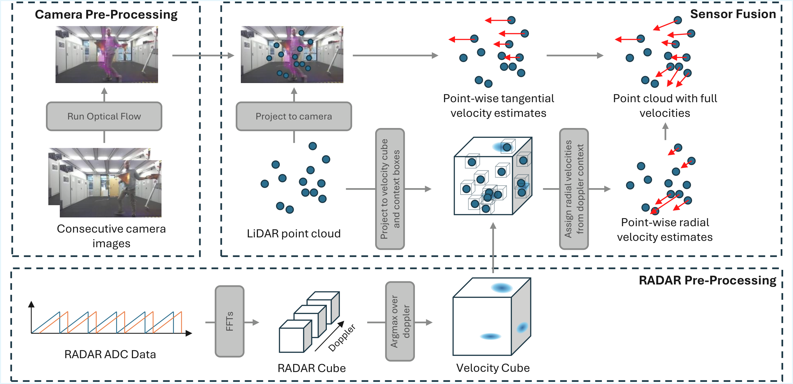

# CaRLi-V: Camera-RADAR-LiDAR point-wise Velocity estimation

Accurate point-wise velocity estimation in 3D is vital for enabling robot interaction with non-rigid dynamic agents such as humans, enabling robust performance in path planning, collision avoidance, and object manipulation in dynamic settings. To this end, we propose a novel RADAR, LiDAR, and camera fusion pipeline for point-wise 3D velocity estimation named CaRLi-V. This pipeline leverages a novel RADAR representation, the velocity cube, which densely represents radial velocities within the RADAR's field-of-view. By combining the velocity cube for radial velocity extraction, optical flow for tangential velocity estimation, and LiDAR for dense point-wise localization measurements through a closed-form formulation, our approach can produce detailed velocity measurements for a dense array of points. This repository comprises of a ROS2 package for 3D dense point-wise velocity estimation using a camera, RADAR, and LiDAR fusion framework.


The pipeline is divided into three steps: RADAR pre-processing, where raw ADC RADAR data is used to compute the RADAR velocity cube, a dense representation of velocities in the environment; Camera pre-processing, where two consecutive camera images are used to compute optical flow vectors for each pixel in the image; Sensor fusion, where the LiDAR point cloud is projected into both representations to extract radial velocity and optical flow readings, with both estimates combined through a closed-form solution.


The pipeline is able to (a) discern velocities between different dynamic agents; (b) estimate both radial and tangential velocities, as well as combinations of both, and (c, d) extract velocities from single parts of non-rigid moving agents, such as individual limbs in humans.

See a demonstration of our pipeline in action by clicking on the image below:

[](https://youtu.be/oy1B_Mmpvt0)

## Installation

This repository was built on Ubuntu 22.04 for ROS2 Humble. To install the necessary packages to run the ROS nodes:

```
cd ros
pip install -r src/carli_v/requirements.txt
```

Then build using colcon:

```
colcon build --symlink-install
source install/setup.bash
```

## Usage
Several launch files exist to facilitate the running of the pipeline. We will soon provide the dataset the pipeline was developed with. 

To run the full pipeline:
```
ros2 launch carli_v radar_full_velocity.launch.py
```

To run only the radar-lidar fusion node:
```
ros2 launch carli_v radar_mode.launch.py
```
